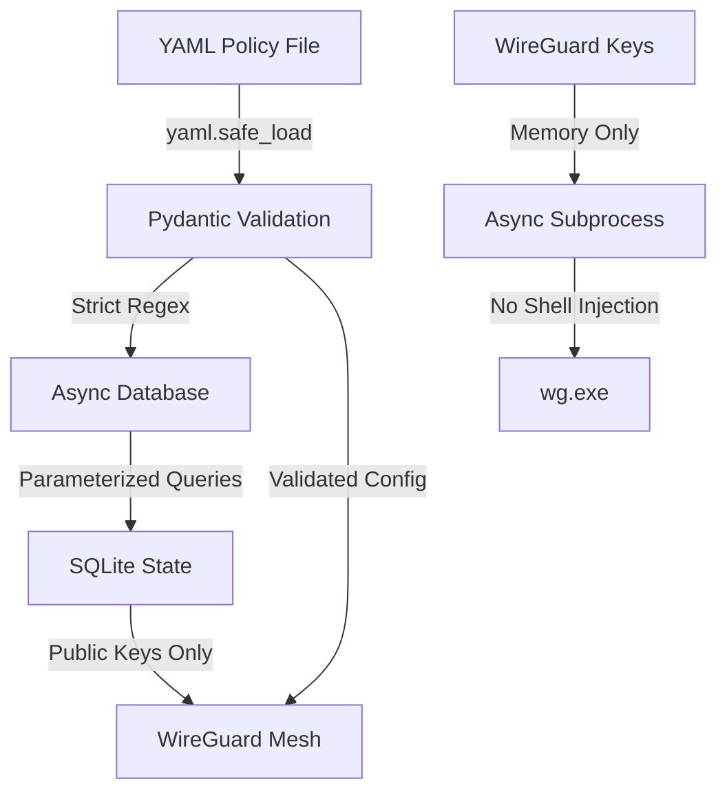

<div align="center">

# SafeNet SOHO Security Framework

**A Zero-Trust Micro-Perimeter Framework for Small Office/Home Office Environments**

[](https://www.python.org/)
[](https://www.wireguard.com/)
[](LICENSE)
[](#project-status)

*Policy-driven, asynchronous, and hardened against injection attacks*

[Features](#-key-features) • [Architecture](#-architecture) • [Setup](#-quick-start) • [Documentation](#-documentation) • [Roadmap](#-development-roadmap)

</div>

---

## Table of Contents

- [Overview](#-overview)
- [Key Features](#-key-features)
- [Project Status](#-project-status)
- [Architecture](#-architecture)
- [Tech Stack](#-tech-stack)
- [Quick Start](#-quick-start)
- [Testing](#-testing)
- [Project Structure](#-project-structure)
- [Development Roadmap](#-development-roadmap)
- [Security](#-security)
- [Documentation](#-documentation)
- [License](#-license)

---

## Overview

**Project SafeNet** is a lightweight, policy-driven Zero-Trust security framework designed for SOHO (Small Office/Home Office) environments. It leverages WireGuard to create an encrypted mesh network with declarative access control policies, all managed through a modern asynchronous Python backend.

### The Problem

Traditional home networks are **flat** and **permissive** — once a device connects to your Wi-Fi, it can access everything. IoT devices, smart TVs, and guests share the same network as your work laptop and private files.

### The Solution

SafeNet creates **micro-perimeters** around device groups with:
- **Zero-Trust Architecture**: Default deny, explicit allow
- **Declarative Policies**: Define network rules in YAML
- **WireGuard Mesh**: Encrypted peer-to-peer communication
- **Memory-Only Keys**: Private keys never touch disk
- **Fully Async**: Non-blocking I/O for maximum performance

---

## Key Features

### Implemented (Phases 1-3)

[COMPLETE] **In-Memory Cryptography Engine** (Phase 1)
- Async WireGuard key generation
- Zero-disk-key architecture
- Subprocess security (command injection prevention)

[COMPLETE] **YAML Policy Parser** (Phase 2)
- Declarative security-as-code
- Strict input validation via Pydantic
- Safe YAML loading (prevents code injection)

[COMPLETE] **Async Database Layer** (Phase 2)
- SQLite with `aiosqlite` for non-blocking I/O
- Parameterized queries (SQL injection prevention)
- Device and group management

[COMPLETE] **WireGuard Subprocess Driver** (Phase 3)
- Async tunnel lifecycle management (start/stop/status)
- WireGuard INI config generation
- Windows network stack control (live validated)
- Absolute path resolution for Windows services
- Secure config cleanup

### Coming Soon (Phases 4-5)

[IN PROGRESS] **FastAPI Endpoints** (Phase 4)
- RESTful API with JWT authentication
- TLS/HTTPS enforcement
- Device enrollment and management

[IN PROGRESS] **Typer CLI Interface** (Phase 5)
- Command-line management tools
- Interactive setup wizard
- Status monitoring

---

## Project Status

| Phase | Component | Status | Tests |
|-------|-----------|--------|-------|
| **Phase 1** | In-Memory Cryptography | [COMPLETE] Complete | 4/4 Passing |
| **Phase 2** | Policy Parser & Database | [COMPLETE] Complete | 7/7 Passing |
| **Phase 3** | WireGuard Subprocess Driver | [COMPLETE] Complete + Live Tested | 9/9 Passing |
| **Phase 4** | FastAPI Endpoints | [IN PROGRESS] In Progress | - |
| **Phase 5** | Typer CLI Interface | Planned | - |

**Current Version**: `0.3.0` (Phase 3 Complete - Network Validated)

---

## Architecture

### The "Antigravity" Security Model

SafeNet follows a hardened architecture with multiple defense layers:



### Security Principles

1. **Asynchronous-First**: Non-blocking I/O throughout
2. **Zero-Trust Cryptography**: Private keys never persist to disk
3. **Input Sanitization**: Regex validation prevents injection attacks
4. **Defense in Depth**: Multiple validation layers
5. **Fail-Secure**: Errors default to deny

### Data Flow

```
User Policy (YAML) 
 ↓
Pydantic Validation (Regex Checks)
 ↓
Async SQLite Database (Public Keys Only)
 ↓
WireGuard Config Generation
 ↓
Encrypted Mesh Network
```

---

## Tech Stack

### Core Technologies

| Component | Technology | Purpose |
|-----------|------------|---------|
| **Language** | Python 3.10+ | Async/await, type hints |
| **VPN** | WireGuard | Fast, modern VPN protocol |
| **Database** | SQLite + aiosqlite | Async state management |
| **Validation** | Pydantic v2 | Schema validation |
| **Config** | PyYAML | Policy parsing |
| **API** | FastAPI *(Phase 4)* | REST endpoints |
| **CLI** | Typer *(Phase 5)* | Command-line interface |

### Security Stack

- **Regex Validation**: `^[a-zA-Z0-9_-]{3,32}$` (prevents injection)
- **Parameterized Queries**: SQL injection prevention
- **yaml.safe_load**: Code injection prevention
- **subprocess.exec**: Command injection prevention

---

## Quick Start

### Prerequisites

1. **Python 3.10+**
 ```powershell
 python --version
 ```

2. **WireGuard for Windows**
 - Download: https://www.wireguard.com/install/
 - Add to PATH: `C:\Program Files\WireGuard`

3. **Git** (for cloning)

### Installation

```powershell
# Clone the repository
git clone https://github.com/alvin-alvo/safenet-soho-security-framework.git
cd safenet-soho-security-framework

# Create virtual environment
python -m venv venv
.\venv\Scripts\Activate.ps1

# Install dependencies
pip install -r requirements.txt
```

### Verify Installation

```powershell
# Add WireGuard to PATH (if not already)
$env:Path += ";C:\Program Files\WireGuard"

# Run all tests
python tests\run_all_tests.py

# Or run individual phases
python tests\test_phase1.py # Phase 1: Cryptography
python tests\test_phase2.py # Phase 2: Policy & DB
python tests\test_phase3.py # Phase 3: WireGuard Driver
```

Expected output:
```
 Phase 1: PASSED (4/4 tests)
 Phase 2: PASSED (7/7 tests)
 Phase 3: PASSED (9/9 tests)
```

---

## Testing

### Run All Tests

```powershell
# All phases
python tests\run_all_tests.py

# Individual phases
python tests\test_phase1.py # Cryptography engine
python tests\test_phase2.py # Policy parser & database
```

### Test Coverage

- **Phase 1**: 4 tests (key generation, format, randomness, zero-disk)
- **Phase 2**: 7 tests (schema, YAML, database, SQL injection, etc.)
- **Phase 3**: 9 tests (config generation, paths, security, tunnel lifecycle)

### Live Network Validation (Phase 3)

```powershell
# Requires Administrator privileges
python tests\test_engine.py
```

This creates a real WireGuard tunnel and validates Python control of the Windows network stack via `ipconfig`.

See [`tests/README.md`](tests/README.md) for detailed test documentation.

---

## Project Structure

```
safenet-soho-security-framework/
│
├── core/ # Core framework components
│ ├── __init__.py # Module exports (v0.3.0)
│ ├── keygen.py # [COMPLETE] In-memory key generation (Phase 1)
│ ├── schemas.py # [COMPLETE] Pydantic validation models (Phase 2)
│ ├── db.py # [COMPLETE] Async SQLite database (Phase 2)
│ ├── policy.py # [COMPLETE] YAML policy parser (Phase 2)
│ └── engine.py # [COMPLETE] WireGuard subprocess driver (Phase 3)
│
├── api/ # FastAPI endpoints (Phase 4)
│ └── __init__.py
│
├── cli/ # Typer CLI interface (Phase 5)
│ └── __init__.py
│
├── data/ # Runtime data and policies
│ ├── policy.yml # [COMPLETE] Network policy configuration
│ └── safenet.db # SQLite database (auto-generated)
│
├── tests/ # Test suite
│ ├── __init__.py # Test module init
│ ├── test_phase1.py # [COMPLETE] Phase 1 validation tests
│ ├── test_phase2.py # [COMPLETE] Phase 2 validation tests
│ ├── test_phase3.py # [COMPLETE] Phase 3 validation tests
│ ├── test_engine.py # [COMPLETE] Live network validation test
│ ├── test_tunnel_manual.py # Manual tunnel lifecycle test
│ ├── run_all_tests.py # Test runner (all 3 phases)
│ └── README.md # Test documentation
│
├── docs/ # Documentation
│ ├── phase1_implementation.md
│ ├── phase1_validation_success.md
│ ├── phase2_validation_success.md
│ ├── phase2_complete.md
│ ├── phase3_validation_success.md # [COMPLETE] Phase 3 validation
│ ├── phase3_final_validation.md # [COMPLETE] Live network test
│ ├── phase3_complete.md
│ └── windows_setup_commands.md
│
├── reference/ # Design documents
│ ├── Project SafeNet... .pdf # Original research document
│ ├── architecture.md # "Antigravity" architecture
│ ├── phase1.md # Phase 1 specifications
│ ├── phase2.md # Phase 2 specifications
│ └── phase3.md # Phase 3 specifications
│
├── certs/ # TLS certificates (Phase 4)
├── .git/ # Git repository
├── venv/ # Python virtual environment
├── LICENSE # GPL-3.0 license
├── TESTING.md # [COMPLETE] Test execution guide
├── requirements.txt # Python dependencies
└── README.md # This file
```

---

## Development Roadmap

### [COMPLETE] Phase 1: Environment Setup & In-Memory Cryptography (Complete)

- [x] Project structure initialization
- [x] Async WireGuard key generation
- [x] Zero-disk-key architecture
- [x] Comprehensive test suite
- [x] Documentation

**Validation**: 2026-02-13 | **Tests**: 4/4 Passing

---

### [COMPLETE] Phase 2: YAML Policy Parser & Database (Complete)

- [x] Pydantic validation schemas
- [x] Async SQLite database layer
- [x] YAML policy parser (yaml.safe_load)
- [x] SQL/Command injection prevention
- [x] Sample policy configuration
- [x] Comprehensive test suite

**Validation**: 2026-02-13 | **Tests**: 7/7 Passing

---

### [COMPLETE] Phase 3: Windows WireGuard Subprocess Driver (Complete)

- [x] `core/engine.py` implementation
- [x] WireGuard config file generation (INI format)
- [x] Tunnel lifecycle management (start/stop/status)
- [x] Absolute path resolution for Windows services
- [x] Security constraints (zero command injection)
- [x] Comprehensive test suite (9 tests)
- [x] Live network validation (ipconfig verified)

**Validation**: 2026-02-13 | **Tests**: 9/9 Passing | **Live**: [COMPLETE] Network Stack Control Proven

---

### Phase 4: FastAPI Endpoints & JWT Authentication (Planned)

- [ ] FastAPI application setup
- [ ] Protected API endpoints
- [ ] JWT token authentication
- [ ] TLS/HTTPS configuration
- [ ] Device enrollment API
- [ ] Network management API

**Target**: TBD

---

### Phase 5: Typer CLI Interface (Planned)

- [ ] CLI command structure
- [ ] Device management commands
- [ ] Policy management commands
- [ ] Network control commands
- [ ] Interactive setup wizard
- [ ] Rich terminal output

**Target**: TBD

---

## Security

### Attack Surface Mitigation

| Attack Vector | Mitigation |
|---------------|------------|
| **Command Injection** | Regex validation: `^[a-zA-Z0-9_-]{3,32}$` |
| **SQL Injection** | Parameterized queries only |
| **YAML Code Injection** | `yaml.safe_load` (no arbitrary code execution) |
| **Private Key Leakage** | Memory-only storage, never written to disk |
| **Man-in-the-Middle** | WireGuard encrypted tunnels + TLS API *(Phase 4)* |

### Security Testing

All phases include security-focused tests:
- Input validation (malicious device names)
- Injection attempt detection
- Cryptographic key security
- Zero-disk-key verification

See validation reports in [`docs/`](docs/) for detailed security analysis.

---

## Documentation

### User Documentation

- [Windows Setup Commands](docs/windows_setup_commands.md) - Installation guide
- [Test Documentation](tests/README.md) - Running tests
- [Testing Guide](TESTING.md) - Phase 3 live network testing
- [Phase 3 Complete](docs/phase3_complete.md) - Current status summary

### Implementation Documentation

- [Phase 1 Validation Report](docs/phase1_validation_success.md)
- [Phase 2 Validation Report](docs/phase2_validation_success.md)
- [Phase 3 Validation Report](docs/phase3_validation_success.md)
- [Phase 3 Live Network Test](docs/phase3_final_validation.md)
- [Architecture Overview](reference/architecture.md) 
- [Phase 1 Specifications](reference/phase1.md)
- [Phase 2 Specifications](reference/phase2.md)
- [Phase 3 Specifications](reference/phase3.md)

---

## Contributing

Contributions are welcome! This project is licensed under GPL-3.0.

**To contribute:**
1. Fork the repository
2. Create a feature branch
3. Make your changes
4. Run all tests (`python tests/run_all_tests.py`)
5. Submit a pull request

Please ensure all security tests pass before submitting.

---

## License

This project is licensed under the GNU General Public License v3.0 - see the [LICENSE](LICENSE) file for details.

**Key Points:**
- [COMPLETE] Free to use, modify, and distribute
- [COMPLETE] Source code must remain open
- [COMPLETE] Derivative works must use GPL-3.0
- [NO] No warranty provided

---

## Acknowledgments

- **WireGuard**: Modern, fast VPN protocol
- **FastAPI**: High-performance async web framework
- **Pydantic**: Data validation and settings management

---

<div align="center">

**Built with for Zero-Trust SOHO Security**

[Report Bug](https://github.com/alvin-alvo/safenet-soho-security-framework/issues) • [Request Feature](https://github.com/alvin-alvo/safenet-soho-security-framework/issues)

</div>
