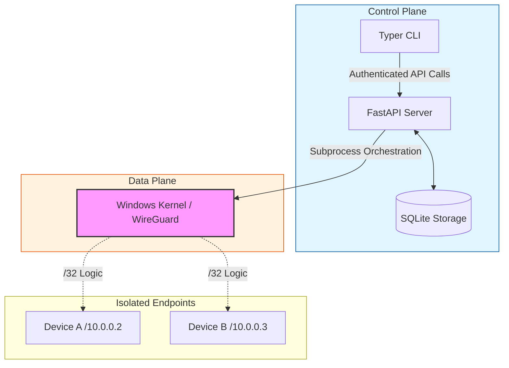

# SafeNet SOHO Security Framework

[](https://www.python.org/)
[](https://fastapi.tiangolo.com/)
[](https://www.wireguard.com/)
[](LICENSE)

SafeNet is a production-grade Zero-Trust Network Access (ZTNA) framework specifically engineered for Small Office/Home Office (SOHO) environments. By orchestrating a secure, identity-aware VPN overlay utilizing the **WireGuard** protocol, SafeNet provides granular control over network access through dynamic peer synchronization and strict **/32 CIDR microsegmentation**. The framework ensures a high-security perimeter via ephemeral cryptographic key management and a modern asynchronous control plane.

---

## Core Architecture

SafeNet implements a rigid **Hub-and-Spoke** topology where the central gateway acts as the authoritative Control Plane. Lateral movement is mathematically restricted through the enforcement of **/32 CIDR masks** for every connected peer, ensuring that devices remain isolated within the overlay unless explicit routing policies are defined.

### System Topology



> **Note on Microsegmentation**: By assigning unique /32 addresses and managing the AllowedIPs table dynamically, SafeNet prevents unauthorized east-west traffic between peers at the kernel level.

---

## Key Features

*   **JWT-Based Authentication**: Secure, token-based access control for all management operations.
*   **Automated Network Orchestration**: Programmatic management of Windows WireGuard services and interfaces.
*   **Dynamic Peer Synchronization**: Real-time updates to the WireGuard configuration without tunnel interruption.
*   **Cryptokey Routing**: Verified public-key identity binding for every network packet.
*   **Zero-Disk-Key Policy**: Ephemeral server keys are managed in memory and cleared upon service termination.

---

## Comprehensive Setup Guide

### Method 1: Automated Deployment (Recommended)

SafeNet provides automated batch scripts to handle environment preparation and gateway ignition.

1.  **Initialize Environment**: Double-click `setup_env.bat`. This script verifies the Python installation, creates a local virtual environment, and installs all required dependencies.
2.  **Launch Gateway**: Right-click `run_server.bat` and select **Run as Administrator**. This elevates the process to allow the FastAPI backend to interface with the Windows kernel and WireGuard driver.

### Method 2: Manual Deployment (Advanced)

For developers requiring granular control over the initialization sequence:

1.  **Prerequisites**: Ensure [WireGuard for Windows](https://www.wireguard.com/install/) is installed and added to the System PATH.
2.  **Virtual Environment**:
    ```bash
    python -m venv venv
    .\venv\Scripts\activate
    ```
3.  **Install Dependencies**:
    ```bash
    pip install -r requirements.txt
    ```
4.  **Launch Server**:
    Open an **Elevated Command Prompt (Administrator)** and execute:
    ```bash
    python run_api.py
    ```

---

## CLI Administration Dashboard

The administrative interface allows for rapid enrollment and status monitoring of the security perimeter.

```bash
# Verify system and interface status
python cli/console.py status

# Activate the WireGuard tunnel service
python cli/console.py start

# Enroll a new device and generate a /32 configuration
python cli/console.py enroll new-device-name
```

---

## Documentation Directory

| Document | Description |
| :--- | :--- |
| [Architecture](docs/ARCHITECTURE.md) | Technical deep dive into ZTNA principles and data flow. |
| [API Contract](docs/FRONTEND_API_CONTRACT.md) | REST API specifications and authentication schemas. |
| [Setup Guide](docs/SETUP.md) | Detailed prerequisite and installation troubleshooting. |
| [CLI Reference](docs/CLI_REFERENCE.md) | Detailed command syntax and administrative usage. |

---

## License & Security Disclaimer

Project SafeNet is released under the **GPL-3.0 License**. 

> **Security Warning**: This framework is designed to manage SOHO security perimeters. Users are responsible for ensuring that the underlying Windows host is hardened and that Administrator privileges are managed according to the principle of least privilege.
